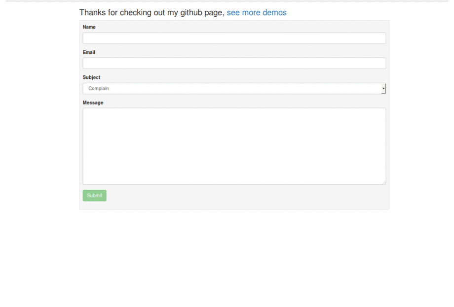

# angular2-form
Angular 2 form submission

#Environment Setup
You need to have nodeJS (npm) installed
<ul>
<li>The project has been well commented to avoid typing a long read :) </li>
</ul>

#Instructions
<ul>
<li>Download the zip file and extract it to your preffered location </li>
</ul>
cd angular2-form  
npm install</blockqoute> to install all the dependecies  
run gulp from the terminal to start the gulp server  

NB: This project has been configured to allow you to expand it into any major and cool project you have in mind  

